# Criar novas páginas no My Account

Este app tem os seguintes objetivos:

- **Substituir a tela nativa de pedidos** por uma tela full headless, permitindo ao cliente definir o design e adicionar elementos personalizados não presentes na versão padrão.
- **Criar novas páginas** dentro do My Account.

Baixe esta app, crie um workspace e execute um `vtex link` para visualizar as mudanças no My Account. Abaixo, vamos entender a estrutura desta app.

## Configurações Iniciais

Antes de começar, é essencial configurar o nome da conta (também conhecido como *vendor*) e o nome do app no arquivo `manifest.json`. Certifique-se de que esses valores estejam corretos para garantir a integração adequada com a plataforma VTEX.

Exemplo de configuração no `manifest.json`:

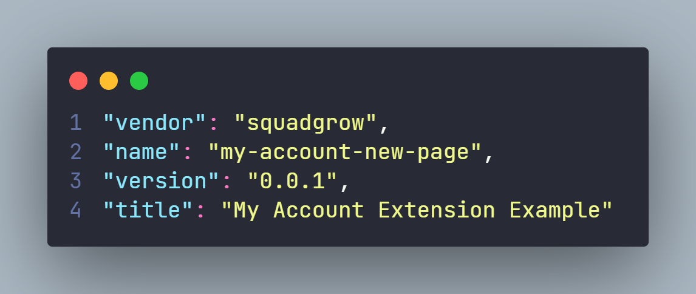

## Substituir a Tela Nativa de Pedidos

Este guia descreve as etapas para substituir a página nativa de pedidos no My Account:

### 1. Criar o Componente da Nova Tela de Pedidos

Para começar, crie um componente que referencie a nova página de pedidos. Esse componente irá substituir a página nativa. Abaixo está um exemplo de código:

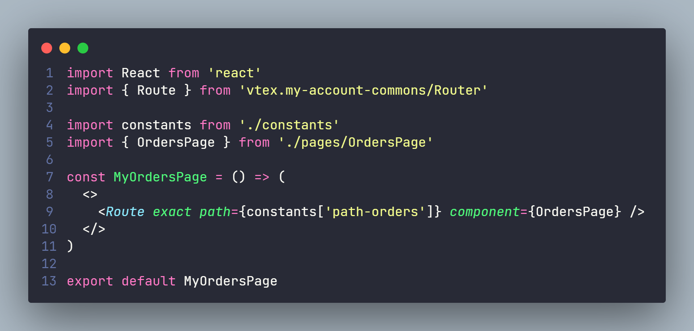

Na imagem acima, o valor `constants['path-orders']` é utilizado para buscar o path definido na pasta de *constants*, que neste caso é `/orders`. Esse path é o padrão e tem o formato `/account#/orders`. O `path` deve ser sempre **/orders**, pois esse é o caminho utilizado pelo My Account para a tela de pedidos nativa. Se preferir, você pode definir o path diretamente no código:

`<Route exact path="/orders" component={OrdersPage} />`

No `component={OrdersPage}`, você define o componente React que substituirá a página de pedidos nativa. O nome do componente (`OrdersPage`) pode ser alterado para qualquer nome que você preferir. Este componente será responsável por renderizar a nova interface de pedidos, permitindo incluir personalizações de design e funcionalidades exclusivas que não estão disponíveis na versão nativa. Assim, você poderá desenvolver toda a nova página de pedidos de forma full headless.

### 2. Criar o Componente que Referencia o Link de Pedidos

Crie um componente que irá referenciar o link da tela de pedidos no My Account.

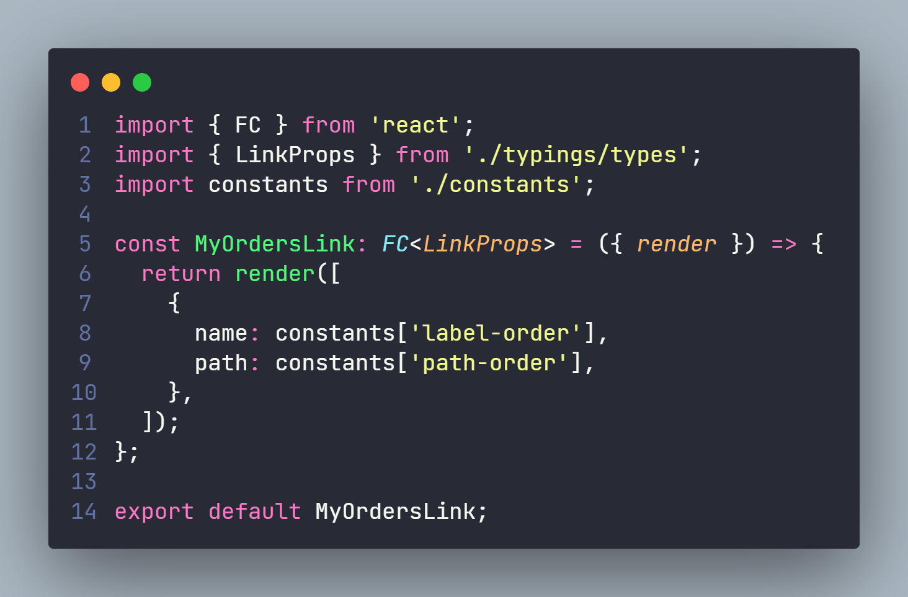

Nesta etapa, você deve define:

- **`name`**: A label deve ser idêntica àquela que já é exibida na página nativa de pedidos.
- **`path`**: O caminho deve ser o mesmo utilizado no componente `MyOrdersPage` (ex.: `/orders`).

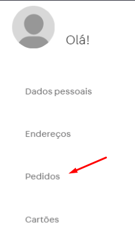

Quando mencionamos **label**, estamos nos referindo à parte destacada na imagem acima, onde o texto do link é renderizado na interface do My Account.

### 3. Criar a Interface Referenciando os Componentes de Link e Página de Pedidos

Agora, crie a interface que irá referenciar tanto o componente de link quanto o da página.

**Importante**: 
Um detalhe fundamental nesta etapa é o nome do **account** (também conhecido como **vendor**). 
Suponha que o `vendor` no arquivo `manifest.json` seja `squadgrow`. Nas interfaces, você precisará referenciar esse vendor especificamente.

Exemplo:

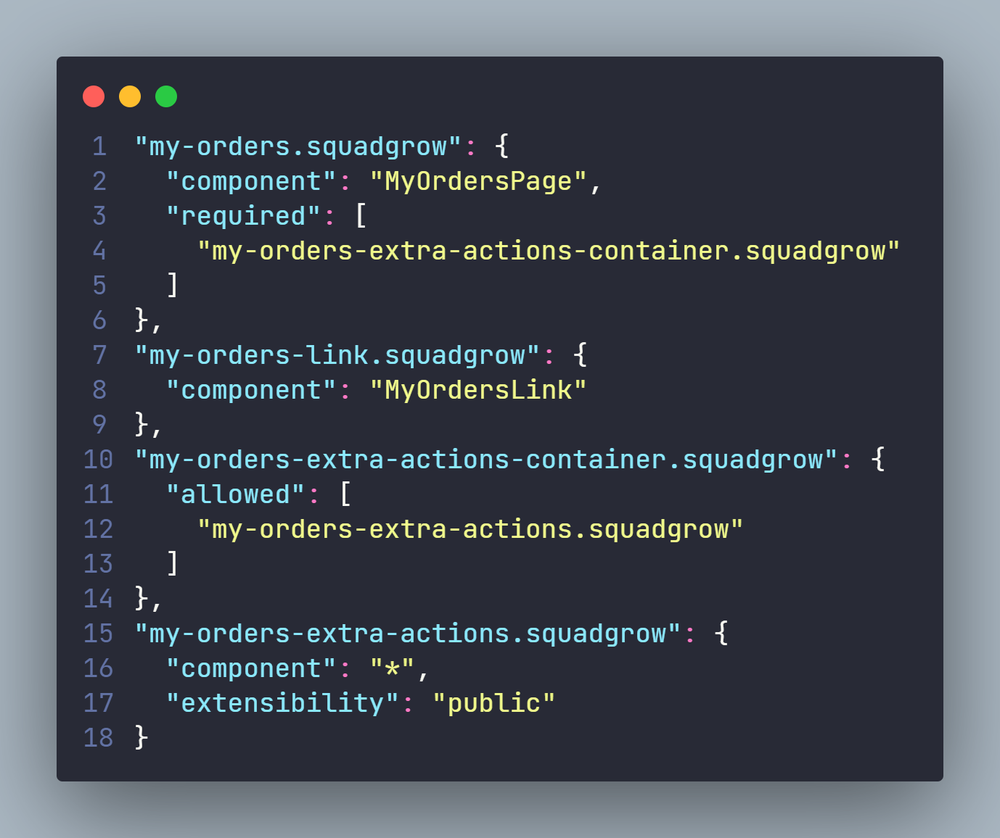

Os nomes `my-orders`, `my-orders-link`, `my-orders-extra-actions-container` e `my-orders-extra-actions` **não podem ser alterados** e todos devem ser configurados corretamente para garantir o perfeito funcionamento.

### 4. Configurar o Arquivo `plugins.json`

No arquivo `plugins.json`, é necessário configurar todos os plugins. Suponha que o `vendor` no arquivo `manifest.json` seja `squadgrow`. Nos plugins, você precisará referenciar esse vendor específico, conforme ilustrado na imagem abaixo:

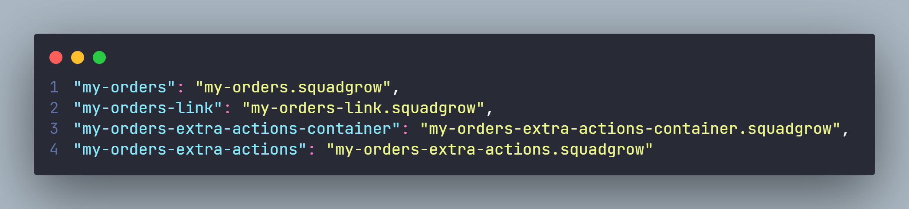\

> **Atenção**:  
> A VTEX prioriza a segurança. Ao criar a tela de pedidos full headless, garanta que apenas usuários logados possam acessar os pedidos e que cada usuário só consiga acessar os pedidos que realmente pertencem a ele.

### 5. Resultado

Quando renderizar esse app a tela de Pedidos do My Account estará assim:

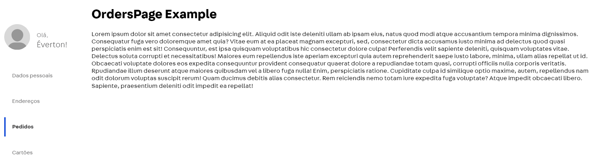

## Criar Nova Página

Este guia descreve as etapas para criar uma nova página no My Account.

### 1. Criar o Componente da Nova Página

Para começar, crie um componente que referencie a nova página. Abaixo está um exemplo de como isso deve ser feito:

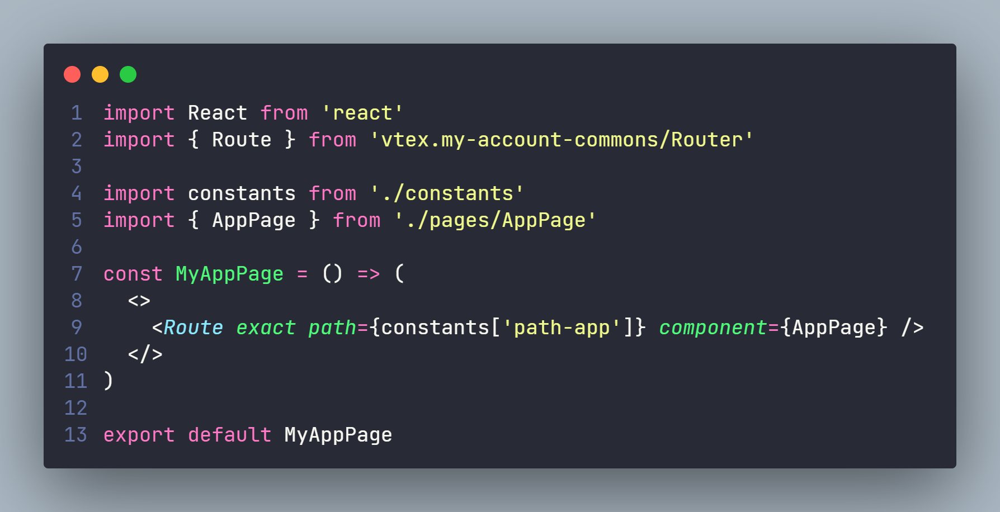

Na imagem acima, o valor `constants['path-app']` é utilizado para buscar o path definido na pasta de *constants*. Esse path será formatado como `/account#/app`. Se preferir, você pode definir o path diretamente no código:

`<Route exact path="/app" component={AppPage} />`

No `component={AppPage}`, você deve passar o componente React que irá renderizar o layout dessa nova tela. O nome do componente (`AppPage`) pode ser qualquer um que você escolher.

O componente de página que você definir será responsável por renderizar a nova interface. Este componente pode incluir personalizações de design e funcionalidades exclusivas que não estão presentes na versão nativa.

### 2. Criar o Componente que Referencia os Links

Crie um componente que irá referenciar o link da nova página no My Account.

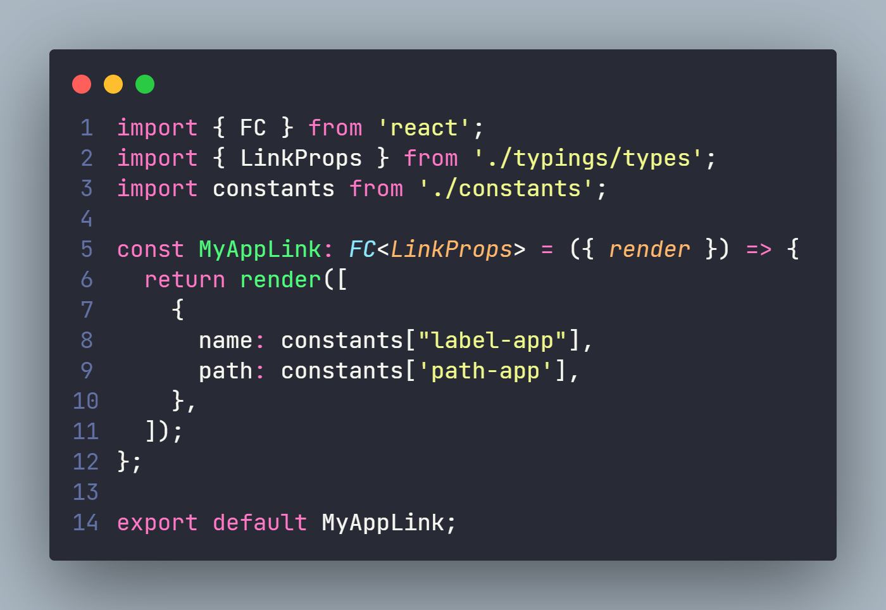

Nesta etapa, você deve definir:

- **`name`**: A label deve ser idêntica àquela que será exibida na nova página.
- **`path`**: O caminho deve ser o mesmo utilizado no componente da nova página (ex.: `/app`).

Quando mencionamos **label**, estamos nos referindo à parte destacada na imagem acima, onde o texto do link será renderizado na interface do My Account.

### 3. Criar a Interface Referenciando os Componentes de Link e Página

Crie a interface que irá referenciar os componentes de link e página.

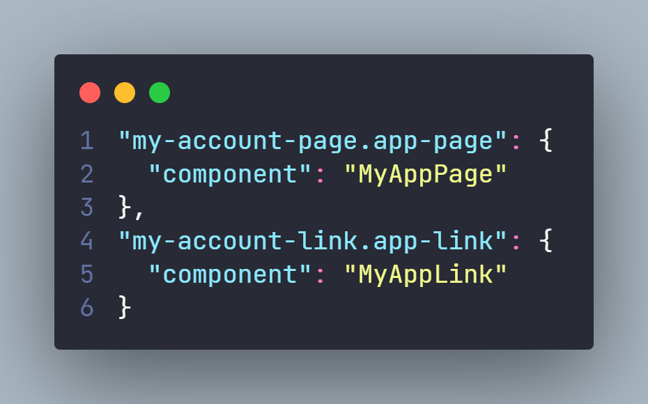

É importante observar que, caso você deseje criar mais de uma página, será necessário repetir os passos 1 e 2 para cada novo componente de link e página. A interface deve ser criada individualmente para cada um deles. 

- Para páginas, os nomes devem começar com `my-account-page`.
- Para links, os nomes devem começar com `my-account-link`.

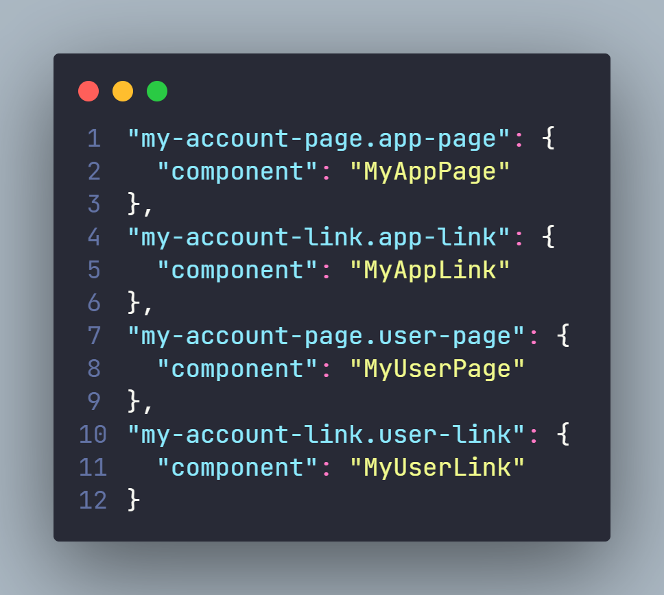

### 4. Configurar o Arquivo `plugins.json`

Configure o arquivo `plugins.json` conforme a necessidade da sua aplicação.

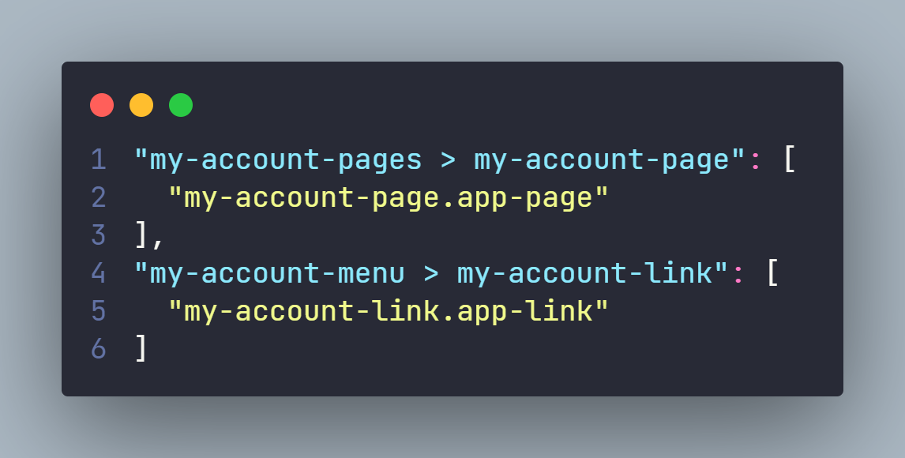

Se você deseja criar mais de uma página e link, os interfaces devem ser organizados dentro dos arrays correspondentes:

- Para uma página, inclua no array `my-account-pages > my-account-page`.
- Para um link, inclua no array `my-account-menu > my-account-link`.

Veja a representação na imagem abaixo:

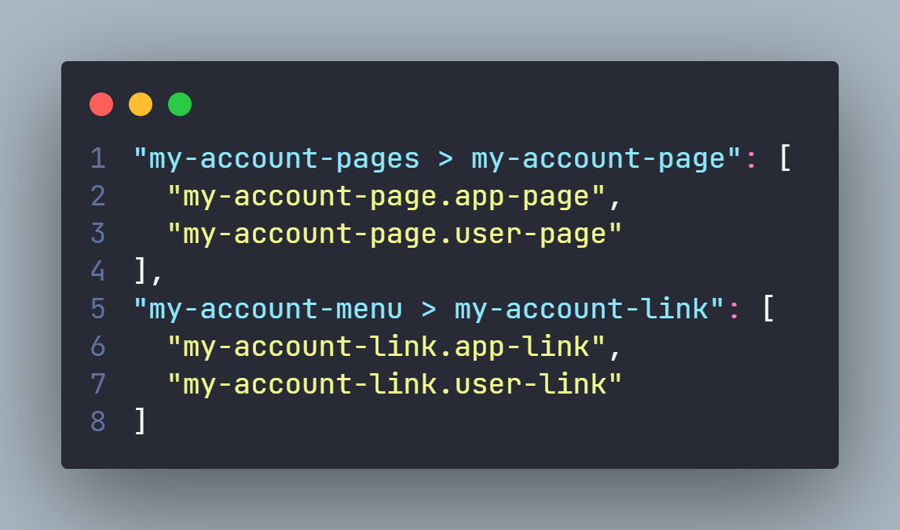

### 5. Resultado

Após a conclusão de todos os passos acima, a nova tela dentro do My Account ficará assim:

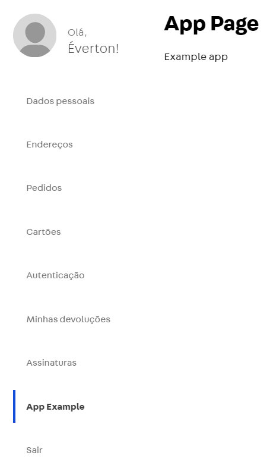

## DEPLOY

Certifique-se de que todas as funcionalidades e o layout estejam conforme desejado antes de realizar o deploy da app e instalá-la na `master`. Isso aplicará automaticamente as alterações no My Account. Não é necessário fazer configurações adicionais em nenhum outro local.